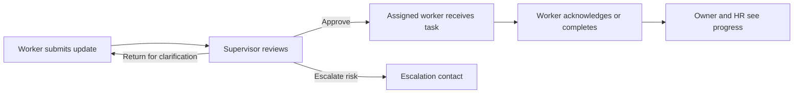

# ShiftRelay: global workforce operations platform

## Product position

ShiftRelay is a mobile-first workforce operations platform for organisations with shifts, distributed teams, recurring work, approvals, and accountability requirements. It gives each organisation a private portal where workers receive only the work assigned to them, supervisors approve or redirect work, and owners or HR teams see progress across the workforce.

**Product promise:** Every handover, task, approval, and acknowledgement has a clear owner, timestamp, and next action.

## Primary users

| User | Main responsibilities | Core screens |
| --- | --- | --- |
| Organisation owner | Creates the organisation, controls settings, sees performance and compliance | Owner dashboard, workforce, workflow builder, reporting |
| HR or administrator | Verifies staff, manages departments, positions, sites, and access | People, invitations, verification queue |
| Supervisor | Reviews submitted work, approves or returns it, escalates risks | Review queue, team dashboard, workflow progress |
| Worker | Receives assignments, completes shift updates, acknowledges handovers | My work, handover capture, notifications |
| Auditor or viewer | Reviews progress without making changes | Read-only reports and audit trail |

## Organisation onboarding

An organisation registration creates a private tenant, not a public workspace. The owner supplies:

- legal organisation name and trading name
- work email, verification phone number, and administrator identity
- primary address, country, operating time zone, and preferred language
- organisation type and industry
- workforce size range, departments, job positions, and work sites
- terms acceptance and privacy/data-processing consent

After verification, ShiftRelay generates a human-friendly organisation code such as `SR-8K4M-27`. The owner can invite workers by email, phone, QR code, or this code. A code alone never grants access; the worker must complete verification and be approved by an administrator or workflow rule.

## Worker enrolment

1. Worker installs the mobile app or opens the web portal.
2. Worker enters the organisation code or accepts an invitation.
3. Worker verifies email or phone with a one-time code.
4. Worker creates their profile: name, position, department, site, time zone, and notification preference.
5. The organisation workflow assigns the registration to the right supervisor or HR reviewer.
6. Once approved, the worker gains only the permissions for their role and site.

## Workflow engine

A workflow is an ordered chain of work. Each step has an assigned role, due time, required evidence, escalation rules, and a next action.

Every event creates a notification for the next responsible person. People can see overall progress, but can only approve, edit, or complete work assigned to their permission level.

## Mobile-first product areas

### Public landing page

- headline: **Work moves forward when handovers do.**
- explanation of shift handovers, workflow routing, and accountability
- organisation registration and worker sign-in
- industry examples without tying the product to one country or region

### Worker app

- My work: assigned tasks, due times, priorities, and progress
- Create handover: text, voice, attachments, and AI structure
- Notifications: approvals, returns, escalations, and assignments
- Profile: position, site, availability, language, and notification preferences

### Supervisor dashboard

- review queue with approval, clarification, reassignment, and escalation
- team progress by shift, site, department, and workflow
- overdue and high-risk work
- evidence and immutable activity timeline

### Owner or HR dashboard

- organisation setup, people, positions, sites, and workflow templates
- live completion rate, acknowledgement time, overdue work, and escalations
- performance trends based on completed work and response times, never opaque AI scoring
- audit log and exports

## Data model

Every table is scoped to `organisation_id` to isolate tenant data.

| Entity | Purpose |
| --- | --- |
| organisations | Verified company profile, organisation code, settings, time zone |
| organisation_sites | Work locations or remote teams |
| departments | Organisational units within a tenant |
| positions | Job roles and permission templates |
| users | Authentication identity and verified contact methods |
| memberships | User-to-organisation role, department, site, supervisor, status |
| workflow_templates | Reusable workflow definitions |
| workflow_steps | Ordered routing rules, assignee role, due policy, escalation policy |
| workflow_runs | A live instance of a template |
| work_items | Individual actionable handover, review, or task records |
| work_events | Immutable submitted, approved, relayed, returned, completed events |
| notifications | In-app, push, email, or SMS delivery records |
| device_tokens | Mobile push-notification registrations |
| audit_logs | Security-sensitive access and administrative changes |

## Security and global readiness

- Email and phone verification; organisation approval for new memberships
- Role-based access control and tenant isolation on every database request
- Secure server-side API keys; never expose secrets in mobile or browser clients
- Time-zone-aware due times and notifications
- Consent, retention settings, audit logging, and export/deletion support
- Localised language and date formatting from the beginning
- Performance reporting based on visible activity records, with transparent definitions

## MVP to build now

The judge-ready vertical slice is intentionally focused:

1. Landing page with organisation registration and worker sign-in entry points
2. Organisation code creation in a Postgres-backed organisation record
3. Mobile worker dashboard for submitting a shift handover
4. Supervisor dashboard for review, approve, return, and relay actions
5. Incoming worker dashboard for acknowledgement and completion
6. Owner dashboard with completion, overdue, and acknowledgement metrics
7. Notifications and an audit event timeline for every workflow action

## Later releases

- Native Android and iOS packaging using Capacitor after the responsive web app is stable
- Push notifications through Firebase Cloud Messaging and APNs
- Attachment uploads, QR invites, multilingual UI, offline queueing, integrations, and advanced analytics
